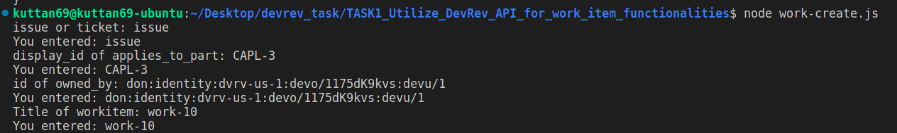
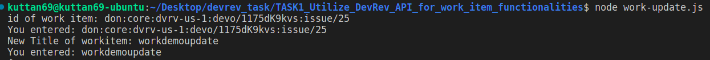
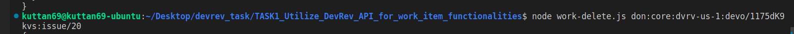

# TASK 1 Utilizing the DevRev API for Work item functionalities


## Work Create

INPUT: 
issue/ticket,
display_id of applies_to_part,
id of owned_by,
Title of workitem


## Run Locally

```bash
node work-create.js
```


## Input




## Output


```bash
  data: {
    work: {
      type: 'issue',
      applies_to_part: [Object],
      created_by: [Object],
      created_date: '2024-04-12T07:09:01.631Z',
      custom_fields: null,
      display_id: 'ISS-26',
      id: 'don:core:dvrv-us-1:devo/1175dK9kvs:issue/26',
      modified_by: [Object],
      modified_date: '2024-04-12T07:09:01.631Z',
      owned_by: [Array],
      priority: 'p2',
      stage: [Object],
      stock_schema_fragment: 'don:core:dvrv-us-1:stock_sf/110623',
      title: 'work-10'
    }
  }
```


## Work Update

INPUT: 
id of work item,
Updated Title of workitem


## Run Locally

```bash
node work-update.js
```


## Input




## Output


```bash
  {
  work: {
    type: 'issue',
    applies_to_part: {
      type: 'capability',
      display_id: 'CAPL-1',
      id: 'don:core:dvrv-us-1:devo/1175dK9kvs:capability/1',
      name: 'Default Capability 1'
    },
    created_by: {
      type: 'dev_user',
      display_id: 'DEVU-1',
      display_name: '4nm20cs069',
      email: '4nm20cs069@nmamit.in',
      full_name: '4NM20CS069 EMMANUEL JOSHY',
      id: 'don:identity:dvrv-us-1:devo/1175dK9kvs:devu/1',
      state: 'active'
    },
    created_date: '2024-04-12T06:09:29.807Z',
    custom_fields: null,
    display_id: 'ISS-25',
    id: 'don:core:dvrv-us-1:devo/1175dK9kvs:issue/25',
    modified_by: {
      type: 'dev_user',
      display_id: 'DEVU-1',
      display_name: '4nm20cs069',
      email: '4nm20cs069@nmamit.in',
      full_name: '4NM20CS069 EMMANUEL JOSHY',
      id: 'don:identity:dvrv-us-1:devo/1175dK9kvs:devu/1',
      state: 'active'
    },
    modified_date: '2024-04-12T07:22:38.133Z',
    owned_by: [ [Object] ],
    priority: 'p2',
    stage: { name: 'triage' },
    stock_schema_fragment: 'don:core:dvrv-us-1:stock_sf/110623',
    title: 'workdemoupdate'
  }
}
```


## Work Delete

INPUT: 
id of work item,


## Run Locally

```bash
node work-update.js [work_id]
```


## Input




## Output


```bash
  data: {}
```


