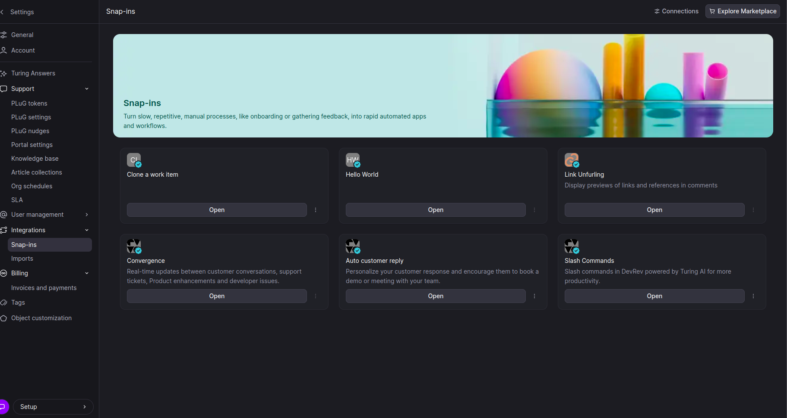

# TASK 3  2.Cloning_work_item


## How to initialize Devrev SDK, build, deploy 

## Create DevRev Snaps TypeScript Template
```
devrev snap_in_version init

```

This repository contains a template for the functions that can be deployed as
part of Snap-Ins.

### Getting started with the template
1. Create a new repository from this template.
2. In the new repository, you can add functions at path `src/functions` where the folder name corresponds to the function name in your manifest file.
3. Each function you add will also need to be mentioned in `src/function-factory.ts` .

### Testing locally
You can test your code by adding test events under `src/fixtures` similar to the example event provided. You can add keyring values to the event payload to test API calls as well.

Once you have added the event, you can test your code by running:
```
npm install
npm run start:watch -- --functionName=function_1 --fixturePath=function_1_event.json
npm run start:watch -- --functionName=function_2 --fixturePath=function_2_event.json
```

### Adding external dependencies
You can also add dependencies on external packages in package.json under the "dependencies" key. These dependencies will be made available to your function at runtime and testing.

### Packaging the code
Once you are done with the testing,
Run
```
npm install
npm run build
npm run package
```
and ensure it succeeds.

You will see a `build.tar.gz` file is created and you can provide it while creating the snap_in_version.


1. Authenticate to devrev CLI
```
devrev profiles authenticate --org <devorg name> --usr <user email>
```
2. Create a snap_in_version
```
devrev snap_in_version create-one --path <template path> --create-package
```
3. Draft the snap_in
```
devrev snap_in draft
```
4. Update the snap_in
```
devrev snap_in update
```
5. Deploy the snap_in
```
devrev snap_in deploy


## Function 1 


```bash
-Works when there is a work item data available 
-Works when we create an issue or ticket 
-DevRev clones work item with title, owned_by, type, applied_to_part
```
    
## Main Part of Function on_work_creation


```bash
   const searchedID = event.payload.work_created.work;
  const applies_to_part = searchedID["applies_to_part"].display_id;
  const owned_by = (searchedID.owned_by as any[]).map(item => item.id);
  const title=searchedID.title;
  const type=searchedID.type;
  const data={   applies_to_part: applies_to_part,
    owned_by: owned_by,
    title: title,
    type:publicSDK.WorkType.Ticket}
  try {
    const response = await devrevSDK.worksCreate(data,undefined);
    if(response.status==200)
      return response;
  } catch (error) {
    console.log(error);
    return error;
  }
  
```

## Result


